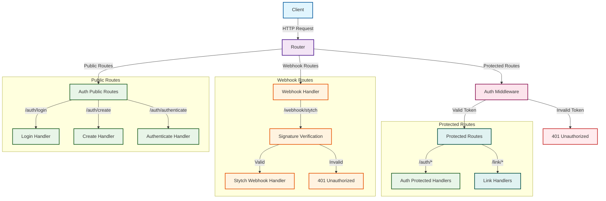
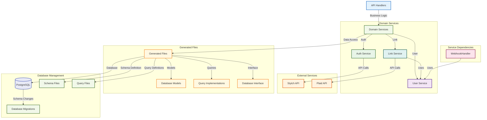

# driftGo

A modern, scalable Go-based backend service built with clean architecture principles. This service provides a robust foundation for building web applications with a focus on maintainability, scalability, and best practices.

## Project Structure

```
driftGo/
├── .github/              # GitHub workflows and configurations
├── api/                  # API layer
│   ├── auth/            # Authentication endpoints
│   ├── common/          # Common API utilities
│   ├── link/            # Link-related endpoints
│   ├── middleware/      # HTTP middleware
│   ├── webhook/         # Webhook handlers
│   │   └── stytch/     # Stytch webhook integration
│   ├── init.go          # API initialization
│   └── router.go        # Router configuration
├── cmd/                  # Command-line applications
│   └── server/          # Main server application
├── config/              # Configuration files
├── db/                  # Database related code
│   └── goose_migrations/ # Database migrations
├── domain/              # Domain layer
│   ├── auth/           # Authentication domain logic
│   ├── link/           # Link domain logic
│   └── user/           # User domain logic
│       └── sqlc/       # SQLC generated code and queries
├── pkg/                 # Shared packages
│   └── logger/         # Logging utilities
├── .air.toml           # Air live reload configuration
├── .gitignore          # Git ignore rules
├── docker-compose.yml  # Docker compose configuration
├── go.mod              # Go module definition
├── go.sum              # Go module checksums
├── Makefile            # Build and development commands
├── sqlc.yaml           # SQLC configuration
└── README.md           # This file
```

## Request Flow Diagrams

### High-Level Request Flow


### Service Layer Architecture


## Architecture Overview

This project follows a clean architecture pattern with the following layers:

1. **API Layer**: Handles HTTP requests, routing, and middleware
   - Authentication endpoints
   - Link management endpoints
   - Common utilities and middleware
   - Router configuration
   - Request/Response handling
   - Input validation
   - Webhook handlers (including Stytch integration)
   - Graceful server shutdown

2. **Domain Layer**: Contains business logic and domain models
   - Authentication domain logic
   - Link domain logic
   - User domain logic with service-based architecture
   - Business rules and validations
   - Domain entities and interfaces
   - Use cases implementation

3. **Database Layer**: Manages data persistence
   - PostgreSQL database integration
   - Goose database migrations
   - SQLC code generation
   - Connection management
   - Query optimization
   - Data access patterns

## Tech Stack

- **Backend**: Go 1.23+
- **Database**: PostgreSQL 15+
- **Containerization**: Docker & Docker Compose
- **Development**: Air (live reload)
- **CI/CD**: GitHub Actions
- **Authentication**: Stytch
- **Database Tools**: 
  - Goose (migrations)
  - SQLC (SQL code generation)
- **Build Tools**: Make

## Prerequisites

- Go 1.23 or higher
- Docker and Docker Compose
- PostgreSQL (if running locally)
- Stytch account and API credentials
- Make (for build commands)

## Getting Started

### Quick Start with Make

1. **Clone the repository**
   ```bash
   git clone https://github.com/imkkapoor/driftGo.git
   cd driftGo
   ```

2. **Set up environment variables**
   ```bash
   cp .env.template .env.local
   # Edit .env.local with your configuration
   ```

3. **Complete development setup**
   ```bash
   make dev-setup
   ```
   This command will:
   - Start Docker containers
   - Run database migrations
   - Generate SQLC code

4. **Start the development server**
   ```bash
   make run
   ```

### Manual Setup

1. **Clone the repository**
   ```bash
   git clone https://github.com/imkkapoor/driftGo.git
   cd driftGo
   ```

2. **Set up environment variables as shown in `.env.template`**

3. **Start the database**
   ```bash
   make docker-up
   ```

4. **Run database migrations**
   ```bash
   make migrate-up
   ```

5. **Generate SQLC code**
   ```bash
   make sqlc-gen
   ```

6. **Install dependencies**
   ```bash
   go mod tidy
   ```

7. **Start the development server**
   ```bash
   make run
   ```

## Development

### Using Make Commands

The project includes a comprehensive Makefile for common development tasks:

#### Docker Operations
```bash
make docker-up      # Start Docker containers
make docker-down    # Stop and remove Docker containers
make docker-restart # Restart Docker containers
```

#### Database Operations
```bash
make migrate-up     # Run database migrations up
make migrate-down   # Rollback database migrations
make migrate-reset  # Reset database (down all, then up all)
make db-status      # Check database migration status
make db-connect     # Connect to database (requires psql)
```

#### Build Operations
```bash
make build          # Build the application
make run            # Run the application with Air (hot reload)
make run-build      # Run the application without hot reload
make clean          # Clean build artifacts
```

#### SQLC Operations
```bash
make sqlc-gen       # Generate SQLC code
make sqlc-clean     # Clean SQLC generated files
make sqlc-reset     # Clean and regenerate SQLC code
```

#### Development Operations
```bash
make test           # Run tests
make lint           # Run linter
make fmt            # Format code
make vet            # Vet code
```

#### Development Workflow
```bash
make dev-setup      # Complete development setup
make dev-clean      # Complete cleanup
```

### Using Air for Live Reload

The project uses Air for live reload during development. Configuration can be found in `.air.toml`. To start development:

```bash
make run
```

### Database Migrations

The project uses Goose for database migrations. Migration files are located in `db/goose_migrations/`:

- `001_users_table.sql` - Creates users table with status enum
- `002_link_table.sql` - Creates links table with foreign key to users

To manage migrations:
```bash
make migrate-up     # Apply all pending migrations
make migrate-down   # Rollback last migration
make migrate-reset  # Reset all migrations
make db-status      # Check migration status
```

### SQLC Code Generation

The project uses SQLC for type-safe SQL code generation. Configuration is in `sqlc.yaml`:

```bash
make sqlc-gen       # Generate Go code from SQL queries
make sqlc-clean     # Remove generated files
make sqlc-reset     # Clean and regenerate
```

Generated files include:
- `models.gen.go` - Database models
- `querier.gen.go` - Query interface
- `db.gen.go` - Database connection

### Graceful Shutdown

The server implements graceful shutdown handling:
- Listens for SIGINT and SIGTERM signals
- Waits up to 30 seconds for active connections to complete
- Logs shutdown progress

## Database Schema

### Users Table
- `id` - Auto-incrementing primary key
- `stytch_user_id` - Stytch user identifier
- `first_name` - User's first name
- `last_name` - User's last name
- `email` - User's email address
- `status` - User status (active/pending)
- `created_at` - Creation timestamp
- `updated_at` - Last update timestamp

### Links Table
- `id` - Auto-incrementing primary key
- `user_id` - Foreign key to users table
- `access_token` - Plaid access token
- `item_id` - Plaid item identifier
- `institution_id` - Financial institution ID
- `institution_name` - Financial institution name
- `created_at` - Creation timestamp
- `updated_at` - Last update timestamp

## Webhook Configuration

The service includes webhook support for authentication events.

### Stytch Auth Webhook Handler

This project implements an **authentication webhook handler** that processes Stytch authentication events. Configure as shown below:

1. Set up your webhook endpoint in the Stytch dashboard
2. Configure the webhook secret in your environment variables
3. The auth webhook handler will automatically process incoming Stytch authentication events

#### Stytch Auth Webhook Security
All incoming Stytch webhook requests are verified using HMAC signature verification before processing. This ensures that only legitimate authentication requests from Stytch are processed, preventing unauthorized webhook calls.

#### Auth Webhook Events Handled
The webhook handler processes the following authentication events:
- User creation events
- User update events  
- User deletion events
- Authentication status changes

## CI/CD Pipeline

The project includes a comprehensive CI/CD pipeline with GitHub Actions:

### Test Job
- Installs SQLC and Goose
- Generates SQLC code
- Runs database migrations
- Executes tests
- Formats and vets code

### Build Job
- Builds the application binary
- Includes version information
- Uploads artifacts for deployment

## Environment Variables

The following environment variables are required:

### Authentication (Stytch)
- `STYTCH_PROJECT_ID`: Your Stytch project ID
- `STYTCH_SECRET`: Your Stytch secret key
- `STYTCH_SIGNUP_REDIRECT_URL`: URL for signup redirect
- `STYTCH_WEBHOOK_SECRET`: Secret for webhook verification

### Plaid Integration
- `PLAID_CLIENT_ID`: Your Plaid client ID
- `PLAID_SECRET`: Your Plaid secret key
- `PLAID_ENV`: Plaid environment (sandbox/development/production)

### Database
- `DATABASE_URL`: PostgreSQL connection string

### Security
- `ENCRYPTION_KEY`: 32+ character encryption key for sensitive data (access tokens)

### Server
- `PORT`: Server port (optional, defaults to 8080)
- `ENV`: Application environment

## Encryption Setup

The application encrypts sensitive data like Plaid access tokens before storing them in the database. 

### Generating an Encryption Key

You need to generate a 32+ character encryption key. Here are a few ways to do this:

**Using OpenSSL:**
```bash
openssl rand -base64 32
```

**Using Python:**
```python
import secrets
import string
import random

# Generate a 32+ character random string
chars = string.ascii_letters + string.digits + string.punctuation
key = ''.join(random.choice(chars) for _ in range(32))
print(key)
```

**Using Node.js:**
```javascript
const crypto = require('crypto');
const chars = 'ABCDEFGHIJKLMNOPQRSTUVWXYZabcdefghijklmnopqrstuvwxyz0123456789!@#$%^&*';
let key = '';
for (let i = 0; i < 32; i++) {
    key += chars.charAt(Math.floor(Math.random() * chars.length));
}
console.log(key);
```

**Simple method (for development):**
```bash
# Generate a 32-character random string
cat /dev/urandom | tr -dc 'a-zA-Z0-9!@#$%^&*' | fold -w 32 | head -n 1
```

### Setting the Encryption Key

Add the generated key to your `.env` file:
```
ENCRYPTION_KEY=your-32-plus-character-key-here
```

**Important:** 
- Keep this key secure and never commit it to version control
- Use the same key across all environments for data consistency
- If you change the key, existing encrypted data will not be decryptable
- The key will be hashed to produce a consistent 32-byte AES-256 key

## Contributing

1. Fork the repository
2. Create your feature branch (`git checkout -b feature/amazing-feature`)
3. Set up the development environment (`make dev-setup`)
4. Make your changes
5. Run tests (`make test`)
6. Format code (`make fmt`)
7. Commit your changes (`git commit -m 'Add some amazing feature'`)
8. Push to the branch (`git push origin feature/amazing-feature`)
9. Open a Pull Request

## License

This project is licensed under the MIT License - see the [LICENSE](LICENSE) file for details.

## Support

For support, please open an issue in the GitHub repository or contact the maintainers. 