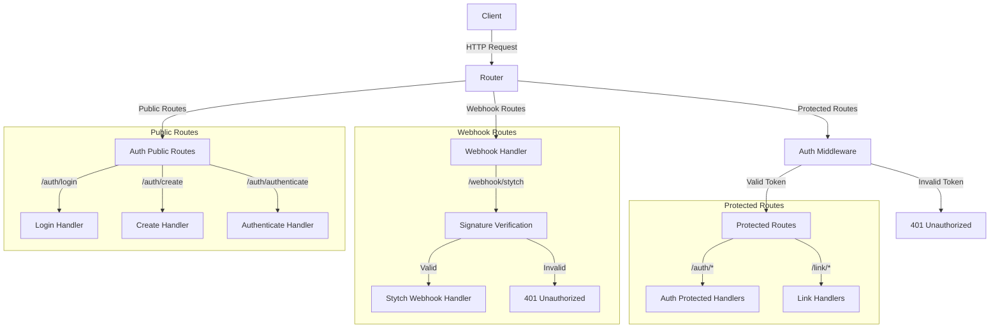
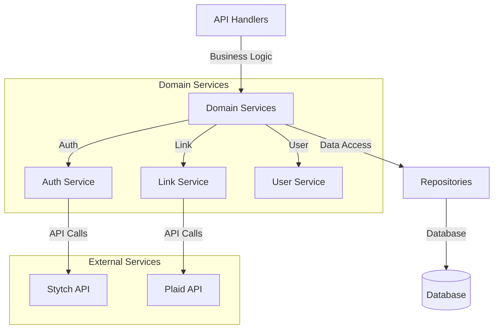

# driftGo

A modern, scalable Go-based backend service built with clean architecture principles. This service provides a robust foundation for building web applications with a focus on maintainability, scalability, and best practices.

## Project Structure

```
driftGo/
├── .github/              # GitHub workflows and configurations
├── .git/                 # Git repository
├── api/                  # API layer
│   ├── auth/            # Authentication endpoints
│   ├── common/          # Common API utilities
│   ├── link/            # Link-related endpoints
│   ├── middleware/      # HTTP middleware
│   ├── webhook/         # Webhook handlers
│   │   └── stytch/     # Stytch webhook integration
│   ├── init.go          # API initialization
│   └── router.go        # Router configuration
├── cmd/                  # Command-line applications
├── config/              # Configuration files
├── db/                  # Database related code
├── domain/              # Domain layer
│   ├── auth/           # Authentication domain logic
│   ├── link/           # Link domain logic
│   └── user/           # User domain logic
├── pkg/                 # Shared packages
├── tmp/                 # Temporary files
├── .air.toml           # Air live reload configuration
├── .gitignore          # Git ignore rules
├── docker-compose.yml  # Docker compose configuration
├── go.mod              # Go module definition
├── go.sum              # Go module checksums
└── main.go             # Application entry point
```

## Request Flow Diagrams

### High-Level Request Flow


### Service Layer Architecture


## Architecture Overview

This project follows a clean architecture pattern with the following layers:

1. **API Layer**: Handles HTTP requests, routing, and middleware
   - Authentication endpoints
   - Link management endpoints
   - Common utilities and middleware
   - Router configuration
   - Request/Response handling
   - Input validation
   - Webhook handlers (including Stytch integration)

2. **Domain Layer**: Contains business logic and domain models
   - Authentication domain logic
   - Link domain logic
   - User domain logic
   - Business rules and validations
   - Domain entities and interfaces
   - Use cases implementation

3. **Database Layer**: Manages data persistence
   - PostgreSQL database integration
   - Database migrations
   - Connection management
   - Query optimization
   - Data access patterns

## Tech Stack

- **Backend**: Go 1.23+
- **Database**: PostgreSQL 15+
- **Containerization**: Docker & Docker Compose
- **Development**: Air (live reload)
- **CI/CD**: GitHub Actions
- **Authentication**: Stytch

## Prerequisites

- Go 1.23 or higher
- Docker and Docker Compose
- PostgreSQL (if running locally)
- Stytch account and API credentials

## Getting Started

1. **Clone the repository**
   ```bash
   git clone https://github.com/imkkapoor/driftGo.git
   ```

2. **Set up environment variables as shown in `.env.template`**

3. **Start the database**
   ```bash
   docker-compose up -d postgres
   ```

4. **Install dependencies**
   ```bash
   go mod tidy
   ```
5. **Start the development server**
   ```bash
   air
   ```

## Development

### Using Air for Live Reload

The project uses Air for live reload during development. Configuration can be found in `.air.toml`. To start development:

```bash
air
```

### Webhook Configuration

The service includes webhook support.

- **Stytch**

    Configure as shown below:

    1. Set up your webhook endpoint in the Stytch dashboard
    2. Configure the webhook secret in your environment variables
    3. The webhook handler will automatically process incoming Stytch events

    ##### Stytch Webhook Security
    All incoming Stytch webhook requests are verified using HMAC signature verification before processing. This ensures that only legitimate requests from Stytch are processed, preventing unauthorized webhook calls.

## Contributing

1. Fork the repository
2. Create your feature branch (`git checkout -b feature/amazing-feature`)
3. Commit your changes (`git commit -m 'Add some amazing feature'`)
4. Push to the branch (`git push origin feature/amazing-feature`)
5. Open a Pull Request

## License

This project is licensed under the MIT License - see the [LICENSE](LICENSE) file for details.

## Support

For support, please open an issue in the GitHub repository or contact the maintainers. 